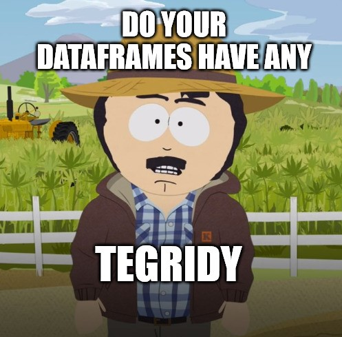

# dftegridy



## 🚧 UNDER CONSTRUCTION 🚧

There are likely some debug print statements as well as unfinalized data structures, so if any bugs arise please be understanding

## When to use dftegridy

Its about time our dataframes had a little 'tegridy

### Data Engineering

Most datasets and databases are expected to grow. Before inserting any new data to your database, wouldnt it be nice to know if the new data had a critical defect that would compromise the integrity of the existing data?

### Analytics

Before deploying a new version of an app, or adding new data to the production server, having a tool to check that the new data meets human and programmed expectations is critical for ensuring safe, reliable, and consistent deployments

### Artificial Intelligence and Data Science

Rarely in AI and DS performed outside of the lab will you train a model on a dataset and then use data from that same source for inference...

Use `dftegridy` as a tool to verify that wild input data is within the expected bounds of your training data, and capture outliers as soon as they appear

## Workflow

### 1 - Profile the DF you want to verify

```python
import pandas as pd
import dftegridy


original_df = pd.DataFrame({
    'record_id': [1, 2, 3, 4, 5],
    'name': ['Joe', 'John', 'David', 'Brett', 'Richard'],
    'occupation': ['Carpenter', 'Carpenter', 'Surveyor', 'Driver', 'Mechanic'],
})

# 1 - Configure the Data Units of the columns
dunit_config = {
    'record_id': dftegridy.dunits.ID_UNIQUE,
    'name': dftegridy.dunits.LABEL,
    'occupation': dftegridy.dunits.CATEGORICAL,
}

# 2 - Create DFID object, profile the data, and save the profile
dfid_profile_path = './example_simple_dfid_profile.yaml'
dfid = dftegridy.DFID(dunit_config=dunit_config)
profile = dfid.profile(original_df)
dfid.save_profile(dfid_profile_path)
```

Which will produce a profile for the configured columns:

```yaml
record_id:
  dtype: int64
  hasna: false
  dunit: id_unique
  count: 5
name:
  dtype: object
  hasna: false
  dunit: label
occupation:
  dtype: object
  hasna: false
  dunit: categorical
  values:
  - Carpenter
  - Driver
  - Mechanic
  - Surveyor
```

### 2 - Verify a newly updated DF against the baseline profile

```python
import pandas as pd
import dftegridy


compare_df = pd.DataFrame({
    'record_id': [6, 7],
    'name': ['Paul', 'Jacob'],
    'occupation': ['Driver', 'Technician'],
    'random_new_col': ['something', 'anotherthing'],
})

# 1 - Load the expected profile of your DF
dfid_profile_path = './example_simple_dfid_profile.yaml'
dfid = dftegridy.DFID()
profile = dfid.load_profile(dfid_profile_path)

# 2 - Verify the new DF and review the report for inconsistencies
report = dfid.verify(compare_df, skip_unverified=False)  # defaults to True
print(report)
```

Which will produce something like:

```txt
--> columns:
  info - New column added
  info - Expected column order != new column order
        - Disregard if column order does not matter

--> occupation:
  info - Unexpected categorical values:
    [
      'Technician'
    ]
```

### [See advanced usage here](./docs/ADVANCED_USAGE.md)

## Catalogued Data Units

| Status | Class | Name | When to use |
| - | - | - | - |
| Live | Id | ID_UNIQUE | Ids that should not ever be duplicated in the df |
| Live | Id | ID_REUSED | Ids that will be reused, like every month a person with their own id has a new record |
| Live | Label | LABEL | Use for anything thats just a cosmetic label and you dont care what the values are |
| Live | Label | FREE_TEXT | Use for anything that is a long text descriptor. In the future there will be more functionality to check length and character encodings and typical considerations for NLP workflows |
| Live | Categorical | CATEGORICAL | Categorical values that have a discrete set of approved values. Accounts for various string and integer datatypes. **Use this for BOOLEAN values** |
| | Measure | MEASURE | Numerical values within and expected range. Basically any int or float that is not an encoding |
| | Date | DATE_DATETIME | When native `datetime` objects are stored |
| | Date | DATE_PATTERN | When you have string values in various pattern formats like: `yyyy-mm-dd` or `dd/mm/yyyy` |
| | Date | DATE_YEAR | String or numeric `YYYY` years |
| | Date | DATE_YYYYQQ | String or int `YYYYQQ` values like `2020q1`, `2020Q4`, `20201`, or `202004` |
| | Date | DATE_QUARTER | String values of any pattern of quarter like: `Quarter 1`, `1 Quarter`, `1Q`, `q2`. If your naming convention pattern doesnt work, dftegridy will let you know |
| | Date | DATE_YYYYMM | String or int `YYYYMM` values like `202001` for January or `202012` for December |
| | Date | DATE_MONTH_NAME | String month names like `January` or `Sep`. Note, if you are not using **full names** or the **3 letter** abbreviations, you need to change your naming pattern |
| | Date | DATE_MONTH_NUMERIC | String or int month numbers like `1`, `7`, etc |
| | Date | DATE_WEEK_0_START | String or int week values with `0` as the first week of the year and `51` as the last week |
| | Date | DATE_WEEK_1_START | String or int week values with `1` as the first week of the year and `52` ad the last week |
| | Date | DATE_DAY | String or int day of the month values `1-31` |
| Live | Unverified | UNVERIFIED | Any field not explicitly called out will be classified as UNVERIFIED and be skipped in profiling and verification |

A note on dates:

* Dates are a real pain in the ass. If your data uses a different format, consider changing it prior to building the profile or please submit a pull request with your custom handler
* I have made a conscious effort to cover various formats I see regularly, but it would be unreasonable to cover every last variant and convention encountered in the wild

## Contributions

* Please extend the abstract `DataUnit` class for any new data types
* For data unit types that dont fall into a grouping of the existing dunit modules, please make a new file. Organization is important and minimizes merge conflicts

## Tests

## License

Inside `dftegridy.dunits` there is a subpackage called `dateinfer`

**This package was not created by me**, it was created by **@jeffreystar** and source can be found at [https://github.com/jeffreystarr/dateinfer](https://github.com/jeffreystarr/dateinfer)

The reason this package is embedded as source instead of being installed from PyPi is because there are early version python relative imports that make the package **unusable in its distributed state**

**The only modifications to the version here are the relative imports have been updated - all credit for the package goes to @jeffreystar**
